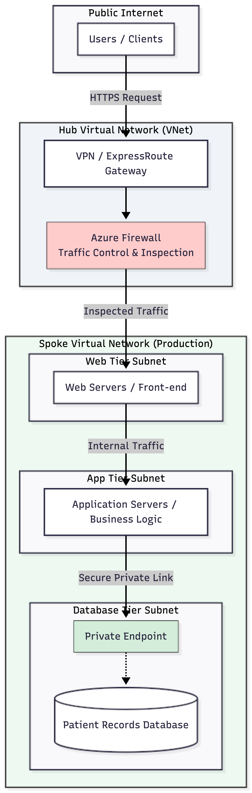
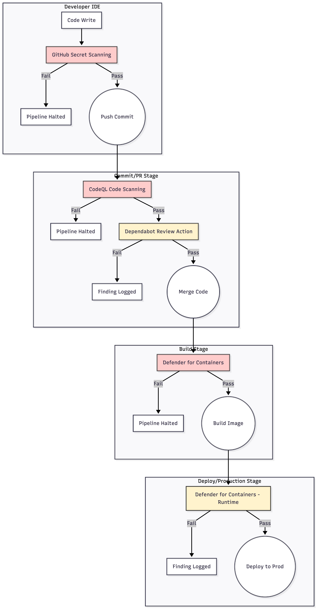

# Secure Cloud Architecture & DevSecOps Implementation Portfolio

This repository contains professional architecture designs, secure CI/CD pipeline workflows, and IAM security models developed for enterprise cloud migrations and secure software delivery.

---

## 1. Secure Azure Cloud Architecture (HLD)
* **Topology:** Hub-and-Spoke VNet design separating core management from production workloads.
* **Security Controls:** Azure Firewall in the central Hub for traffic inspection, 3-tier subnets (Web, App, DB), and a Database Private Endpoint via Private Link.

---

## 2. DevSecOps CI/CD Pipeline Architecture
* **Stages:** Developer IDE, Commit/PR, Build, and Deploy/Production.
* **Gating:** Integrated automated blocking gates (Secret Scanning, CodeQL, Container Vulnerability scanning) and auditing controls to catch misconfigurations and vulnerabilities early.

---

### 3. Identity & Access Management (IAM) Security Flow

* **Authentication:** Microsoft Entra ID with FIDO2 Passwordless Authentication.
* **Enforcement:** Conditional Access Policy Engine assessing user risk, device compliance, and location before granting access to ePHI databases.

  

